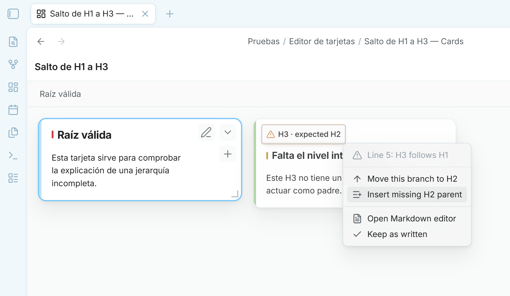
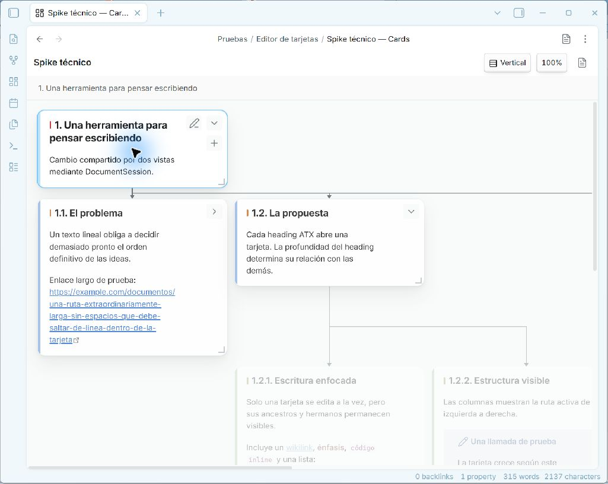

# Visual Card Writer

Visual Card Writer is a desktop plugin for [Obsidian](https://obsidian.md) that turns an ordinary Markdown note into a spatial, card-based writing interface.

The document remains standard Markdown. ATX headings define the hierarchy, and every card edits the corresponding section of the same source file.

> Visual Card Writer is currently an early beta. Back up important notes and test the workflow before adopting it for critical writing.


_GIF showing the UI in action_


## Features

- Navigate a Markdown outline as aligned cards in a horizontal or vertical tree, with subtle orthogonal connectors between parents and their visible children.
- Drag cards to reorder them, move complete branches, or change their depth. Visual Card Writer updates the underlying heading levels automatically.
- Treat an explicit MARP document (`marp: true`) as a flat sequence of draggable slide cards while leaving ordinary Markdown thematic breaks untouched.
- Keep the selected branch in focus by dimming unrelated cards. A global toolbar toggle turns this behavior on or off and remembers the choice across views and reloads.
- Expand or collapse individual branches, or reveal and fold the complete document from the toolbar.
- Create child and sibling cards without leaving the visual editor.
- Edit cards with an embedded CodeMirror 6 editor and essential Live Preview.
- Resize complete columns horizontally and individual cards vertically.
- Pan, scroll in both directions, and zoom without losing the current visual context, including while dragging a card.
- Preserve standard Markdown without proprietary comments or metadata.

## Document format

The hierarchy comes exclusively from ATX headings:

```markdown
# Chapter

Introductory text.

## Scene

Scene content.

### Detail

Supporting detail.
```

Changing a heading level changes that card's position in the hierarchy. Content before the first heading remains outside the card tree.

The hierarchy must start at an H1. If a note has no headings at all, or its topmost headings start below H1 (for example several H2s with no H1 above them), Visual Card Writer automatically inserts a `# <file name>` heading at the top of the note so it has a valid root card, then saves the note with that heading in place.

### Repair skipped heading levels

Skipped heading levels do not block the card editor. If an H3 follows an H1, for example, Visual Card Writer shows the H3 as a direct logical child and marks that card with an amber heading hint. The hint can move only that branch up to the expected level, insert the missing parent card, or leave the Markdown unchanged.



### MARP slide decks

When the YAML frontmatter explicitly sets `marp: true`, Visual Card Writer interprets each `---` slide separator as a card boundary:

```markdown
---
marp: true
---

# Opening

First slide content.

---

# Next idea

Second slide content.
```

Slides remain a flat sequence: drag them before or after one another to reorder the deck. They cannot be nested. Without `marp: true`, a thematic break stays inside the surrounding Markdown section and does not create a new card.

### Horizontal and vertical layouts

Horizontal layout remains the default and grows the hierarchy from left to right. Vertical layout transposes the same tree so hierarchy levels grow downward and sibling branches spread from left to right, which works better in portrait windows. Subtle right-angle connectors branch from each card to every visible direct child and rotate with the layout, making both reading direction and sibling relationships explicit without increasing the gaps. Both orientations use the same Markdown, cards, folding state, zoom, editing, and resize controls.



## Installation

### Community plugins

Visual Card Writer is listed in Obsidian's Community plugins directory. Open **Settings → Community plugins → Browse**, search for **Visual Card Writer**, and install it from there.

### Manual installation

1. Download `main.js`, `manifest.json`, and `styles.css` from the matching GitHub release.
2. Create `<vault>/.obsidian/plugins/visual-card-writer/`.
3. Copy the three files into that directory.
4. Reload Obsidian and enable **Visual Card Writer** under **Settings → Community plugins**.

## Usage

Open a Markdown note and run **Visual Card Writer: Open current note in card editor** from the command palette.

- Select a card to navigate its branch.
- Click the pencil or double-click a card to edit it.
- Click outside the card to save and leave editing.
- Use the `+` button to create a child card where the document structure allows it.
- Drag the right edge to resize every card at that hierarchy level.
- Drag the bottom edge to resize one card vertically.

### Reorder cards and branches

Drag a card over another card and follow the highlighted drop indicator. The source card and its visible descendants stay dimmed in place while a compact floating preview follows the pointer, so both the moving branch and its origin remain clear:

- Drop **before** or **after** to reorder cards at that position.
- Drop on the **child** target to place the card under a new parent.
- Moving a heading card carries its complete descendant branch and rewrites the affected ATX heading levels so the Markdown remains consistent.
- MARP slides support before/after reordering only; slides always remain flat.
- Use the mouse wheel while dragging to reach off-screen targets. Hold `Shift` while using the wheel to move sideways.

### Toolbar and navigation

- Use a card's chevron to expand or collapse its children.
- Use **Expand all** and **Collapse all** to reveal or fold the complete hierarchy.
- Use the orientation toggle to switch between **Horizontal** and **Vertical**. Its text and icon show the current mode; a newly opened card editor starts in Horizontal.
- Branch focus is enabled by default and dims cards outside the selected route. Use the focus/eye toggle to show every card equally; the setting applies to every open card view and persists after reloading Obsidian.
- Middle-drag the background to pan.
- Use the mouse wheel to scroll, or `Shift` + mouse wheel to scroll sideways.
- Hold `Ctrl`/`Cmd` and use the mouse wheel to zoom. Click the zoom percentage to reset it to 100%.

### Commands

- **Visual Card Writer: Open current note in card editor**
- **Visual Card Writer: Switch back to Markdown editor**
- **Visual Card Writer: Add child card**
- **Visual Card Writer: Add sibling card below**
- **Visual Card Writer: Toggle horizontal or vertical card layout**
- **Visual Card Writer: Toggle dimming of cards outside the selected branch**

## Current limitations

- Desktop only.
- Live Preview covers the essential inline Markdown constructs; images, embeds, callouts, and complex block widgets remain source Markdown while editing.
- Skipped heading levels are inferred from the nearest preceding shallower heading and remain visible as local, repairable hints.
- The plugin is under active development and its interaction details may still change.

## Development

Requirements: Node.js 22.13 or later and pnpm 11.

```bash
pnpm install
pnpm run dev
```

Run the complete verification suite with:

```bash
pnpm run check
```

The production build writes an ignored `main.js` at the repository root. Automated releases attach `main.js`, `manifest.json`, and `styles.css` to a tag whose name exactly matches the manifest version, without a `v` prefix. Compiled plugin files belong in GitHub releases, not in the repository history.

## Privacy

Visual Card Writer processes notes locally inside Obsidian. It does not include analytics, advertising, accounts, or network services.

## Contributing

Bug reports and focused pull requests are welcome. See [CONTRIBUTING.md](CONTRIBUTING.md).

## Development note

> Visual Card Writer was unapologetically vibe-coded: built iteratively with AI assistance, then tested and refined inside a real Obsidian vault.

## License

[MIT](LICENSE) © David Hurtado
