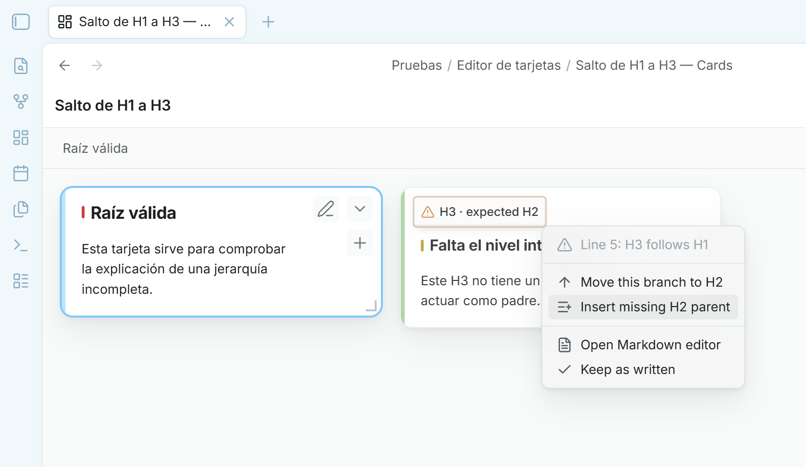
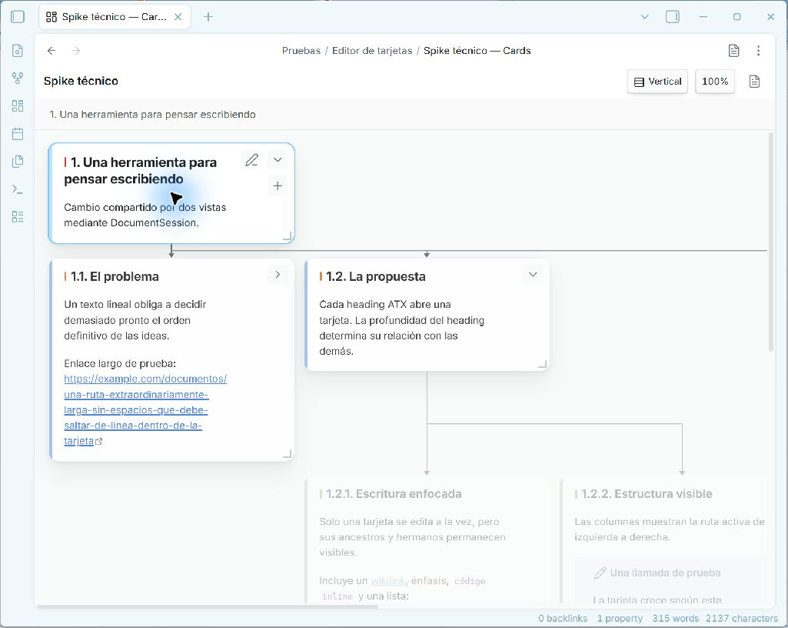
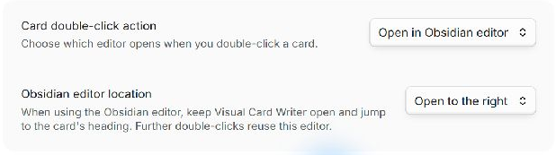

# Visual Card Writer

## Important update — 0.2.0

Visual Card Writer now lets you move between complete sections and individual **text blocks**, using one expand/collapse arrow on each heading. There is no separate mode to enable.

- **Click a card to select it.** Selection no longer opens its children; use the arrow to expand or collapse.
- **Expand a heading** to reveal its subheadings and, when it has two or more text blocks, show those blocks as separate cards. Collapse it to restore the section's complete text.
- **A completely empty line separates text blocks.** Consecutive lines stay together, including a sentence followed immediately by a list, a table, or a callout.
- **Drag headings and text blocks.** Move complete heading branches with their content, reorder blocks, or drop a block onto another heading to move it into that section.

This update is useful for longer, denser, or narrative notes as well as documents with a rich heading structure. Your note stays standard Markdown. See [Sections and text blocks](#sections-and-text-blocks), [Lists, tables and callouts](#lists-tables-and-callouts), and [Reorder cards and branches](#reorder-cards-and-branches) for the complete behavior and limits.

Visual Card Writer is a desktop plugin for [Obsidian](https://obsidian.md) that turns an ordinary Markdown note into a spatial, card-based writing interface.

The document remains standard Markdown. ATX headings define the hierarchy, and every card edits the corresponding section of the same source file.

> Visual Card Writer is currently an early beta. Back up important notes and test the workflow before adopting it for critical writing.


_GIF showing the UI in action_


## Features

- Navigate a Markdown outline as aligned cards in a horizontal or vertical tree, with subtle orthogonal connectors between parents and their visible children.
- Drag cards to reorder them, move complete branches, or change their depth. Visual Card Writer updates the underlying heading levels automatically.
- Treat an explicit MARP document (`marp: true`) as a flat sequence of draggable slide cards while leaving ordinary Markdown thematic breaks untouched.
- Keep the selected branch in focus by dimming unrelated cards. A global toolbar toggle turns this behavior on or off and remembers the choice across views and reloads.
- Expand or collapse individual branches, or reveal and fold the complete document from the toolbar.
- Reveal text blocks within a section with the same arrow, and drag blocks within or between sections.
- Create child and sibling cards without leaving the visual editor.
- Edit cards with an embedded CodeMirror 6 editor and essential Live Preview.
- Optionally double-click a card to open its heading in Obsidian's standard editor, in a new tab or a pane to the right while keeping the card view open.
- Resize complete columns horizontally and individual cards vertically.
- Pan, scroll in both directions, and zoom without losing the current visual context, including while dragging a card.
- Preserve standard Markdown without proprietary comments or metadata.

## Document format

### Sections and text blocks

The section view suits a freer Markdown writing style and documents organized around many headings and subheadings. Each card keeps the content of a section together, including paragraphs, lists, and other Markdown blocks. Headings provide the main units for navigation and editing.

Expanding a section into text blocks can be useful for dense, narrative, or long documents where reviewing individual text blocks helps. **Only a completely empty source line separates text block cards.** Consecutive lines stay together, whether you write a whole paragraph on one line or wrap it manually across several lines. Automatic visual wrapping does not affect the cards. Headings still define the section boundaries. A line containing spaces or tabs is not completely empty and does not split a card.

The two levels of detail are complementary. Use normal cards to read the flow of a section, and text block cards to inspect its individual pieces. Document length alone does not determine which mode fits; the way you write the source matters too.

A single chevron controls each section. Expand it to reveal its subheadings and, when it has at least two direct text blocks, display those blocks as separate cards. Collapse it to hide the branch and restore the section's complete text in its card.

| Section content | What the arrow reveals |
| --- | --- |
| No subheadings and zero or one text block | No arrow is shown; the text stays in the heading card. |
| Two or more text blocks, no subheadings | Separate cards for the text blocks. |
| Subheadings and zero or one text block | The subheadings; the section's own text stays in its heading card. |
| Subheadings and two or more text blocks | Both the subheadings and the section's own text blocks. |

Only the heading's **direct content** counts toward its block total. Each subheading manages its own content. An expanded heading with separate block cards displays its heading text, so the body is not duplicated in two places.

The chevron tooltip explains what a text block is: consecutive lines separated by a completely empty line. Spaces or tabs alone do not separate blocks. Expanding a section does not automatically open its subheadings. The toolbar's **Expand all** and **Collapse all** apply the same behavior throughout the document.

After editing, the chevron's availability updates once typing has paused for 600 ms, without rebuilding the active editor. The card structure updates when the edit finishes. If an open section is reduced to one block or none, its text returns to the heading card.

These choices last only in the current view and are not stored in the note. Changing the presentation does not rewrite the source. Headings and text blocks can be dragged while sections are expanded. To create new heading cards, collapse the text blocks or use the Markdown editor. MARP slide documents keep their usual card presentation.

### Lists, tables and callouts

Collapsed section cards keep bulleted and numbered lists together within their section, preserving the context needed to render nesting and numbering.

Expanded sections use the empty-line rule. A table, a nested or numbered list, or a callout stays in one card when its source lines are consecutive. An introductory sentence immediately followed by a list stays in that same card. Insert a completely empty line before the list or table if you want a separate card.

This is deliberately a simple separator rule, not detection of Markdown block types. A completely empty line inside a list, fenced code block, or other structure also splits it and may interrupt its rendering. A callout line containing `>` is not empty, so it stays with the callout. Group the section to view structures that contain completely empty internal lines as a whole. Source text, indentation, separators, and line endings are preserved.

For example, expanding this section produces three text block cards: the introduction, the complete list with its introductory sentence, and the complete callout:

```markdown
## Campaign
This is the introduction.
This manually wrapped line belongs to the same block.

Benefits:
- Clearer structure
  - Nested items stay with the list
- Easier editing

> [!note] Review
> Check the message before publishing.
>
> This line still belongs to the same callout block.
```

The same rule applies to numbered lists and tables: keep their source lines consecutive to display and move them together. A line containing only spaces or tabs does not count as a separator. Collapse the section if a structured element intentionally contains completely empty internal lines.

### Heading structure

The hierarchy comes exclusively from ATX headings:

```markdown
# Chapter

Introductory text.

## Scene

Scene content.

### Detail

Supporting detail.
```

Changing a heading level changes that card's position in the hierarchy. Content before the first heading remains outside the card tree.

The hierarchy must start at an H1. If a note has no headings at all, or its topmost headings start below H1 (for example several H2s with no H1 above them), Visual Card Writer automatically inserts a `# <file name>` heading at the top of the note so it has a valid root card, then saves the note with that heading in place.

### Repair skipped heading levels

Skipped heading levels do not block the card editor. If an H3 follows an H1, for example, Visual Card Writer shows the H3 as a direct logical child and marks that card with an amber heading hint. The hint can move only that branch up to the expected level, insert the missing parent card, or leave the Markdown unchanged.

Collapse expanded text blocks first to access the heading-repair controls.



### MARP slide decks

When the YAML frontmatter explicitly sets `marp: true`, Visual Card Writer interprets each `---` slide separator as a card boundary:

```markdown
---
marp: true
---

# Opening

First slide content.

---

# Next idea

Second slide content.
```

Slides remain a flat sequence: drag them before or after one another to reorder the deck. They cannot be nested. Without `marp: true`, a thematic break stays inside the surrounding Markdown section and does not create a new card.

### Horizontal and vertical layouts

Horizontal layout remains the default and grows the hierarchy from left to right. Vertical layout transposes the same tree so hierarchy levels grow downward and sibling branches spread from left to right, which works better in portrait windows. Subtle right-angle connectors branch from each card to every visible direct child and rotate with the layout, making both reading direction and sibling relationships explicit without increasing the gaps. Both orientations use the same Markdown, cards, folding state, zoom, editing, and resize controls.



## Installation

### Community plugins

Visual Card Writer is listed in Obsidian's Community plugins directory. Open **Settings → Community plugins → Browse**, search for **Visual Card Writer**, and install it from there.

### Manual installation

1. Download `main.js`, `manifest.json`, and `styles.css` from the matching GitHub release.
2. Create `<vault>/.obsidian/plugins/visual-card-writer/`.
3. Copy the three files into that directory.
4. Reload Obsidian and enable **Visual Card Writer** under **Settings → Community plugins**.

## Usage

Open a Markdown note, then click the **Visual Card Writer** icon in the left ribbon or run **Visual Card Writer: Open current note in card editor** from the command palette.

- Select a card to navigate its branch.
- Clicking the card body selects it without expanding it. Use its chevron to expand or collapse the section; the directional keyboard shortcuts remain available.
- Click the pencil to edit inside a card. Double-click to use your configured editor (the embedded editor by default).
- Click outside the card to save and leave editing.
- Use the `+` button to create a child card where the document structure allows it.
- Drag the right edge to resize every card at that hierarchy level.
- Drag the bottom edge to resize one card vertically.

### Double-click editing preferences

In **Settings → Visual Card Writer**, choose the **Card double-click action**:

- **Edit inside the card** (default): use the existing embedded editor.
- **Open in Obsidian editor**: open the note at the card's heading in Obsidian's standard editor, keeping the card view open.

For the Obsidian editor, choose **New tab** or **Open to the right** under **Obsidian editor location**. The latter keeps the cards and note visible side by side. Subsequent double-clicks reuse the destination editor. Navigation uses the heading's line, so repeated heading titles work too. For MARP cards, navigation goes to the start of the slide. The pencil button and keyboard editing shortcuts continue to use the embedded editor.

For a text block card, the standard editor opens at the block's first source line. The pencil edits that block's source fragment. In an expanded heading card, it edits the heading; collapse the section to edit its complete direct content together. Finish embedded editing with **Escape**, **Ctrl/Cmd + Enter**, or a click outside the card. Block layout changes are applied after editing finishes, so the active editor is not replaced while you type.



To use this workflow, select **Open in Obsidian editor**, then **Open to the right**, and double-click any card. Your note opens in editing mode at that card's section without closing Visual Card Writer.

### Reorder cards and branches

Drag a card over another card and follow the highlighted drop indicator. The source card and its visible descendants stay dimmed in place while a compact floating preview follows the pointer, so both the moving branch and its origin remain clear:

- Drop **before** or **after** to reorder cards at that position.
- Drop on the **child** target to place the card under a new parent.
- Moving a heading card carries its complete descendant branch and rewrites the affected ATX heading levels so the Markdown remains consistent.
- Headings remain draggable when text blocks are expanded. Drop headings on other headings; their complete sections and nested content move together.
- Drag a text block before or after another block to reorder it, including across sections. Drop it anywhere on a heading card to append it to that section's direct content, before its subheadings. Blocks cannot contain other blocks or headings.
- Lists, tables and callouts move as complete text blocks, preserving their source content and indentation. Empty-line separators keep adjacent blocks distinct. If the destination has only one block, it appears inside its heading card.
- MARP slides support before/after reordering only; slides always remain flat.
- Use the mouse wheel while dragging to reach off-screen targets. Hold `Shift` while using the wheel to move sideways.

In horizontal layout, use the upper or lower half of a text block as the before/after target. In vertical layout, use its left or right half. For heading-to-heading moves, follow the highlighted before/after/child indicator. Heading cards cannot be dropped on text block cards, and a heading cannot move into its own descendant branch. Dropping a block onto a heading appends it before any nested subheading, rather than at the end of the entire branch.

Moves update the original Markdown file. Block text and indentation are retained, with empty-line separators added where needed; moving a heading carries its complete content, including blocks hidden in collapsed branches. After a move, a section with only one remaining block displays that block inside its heading card.

### Toolbar and navigation

- Use a card's chevron to expand or collapse its children.
- Use **Expand all** and **Collapse all** to reveal or fold the complete hierarchy.
- Use the orientation toggle to switch between **Horizontal** and **Vertical**. Its text and icon show the current mode; a newly opened card editor starts in Horizontal.
- Branch focus is enabled by default and dims cards outside the selected route. Use the focus/eye toggle to show every card equally; the setting applies to every open card view and persists after reloading Obsidian.
- Middle-drag the background to pan.
- Use the mouse wheel to scroll, or `Shift` + mouse wheel to scroll sideways.
- Hold `Ctrl`/`Cmd` and use the mouse wheel to zoom. Click the zoom percentage to reset it to 100%.

### Commands

- **Visual Card Writer: Open current note in card editor**
- **Visual Card Writer: Switch back to Markdown editor**
- **Visual Card Writer: Add child card**
- **Visual Card Writer: Add sibling card below**
- **Visual Card Writer: Toggle horizontal or vertical card layout**
- **Visual Card Writer: Toggle dimming of cards outside the selected branch**

## Current limitations

- Desktop only.
- Text blocks use completely empty lines as boundaries, including inside structured Markdown; use the collapsed section view for lists or code blocks with empty internal lines.
- New-heading and heading-repair controls require text block cards to be collapsed. Dragging existing headings and blocks works while they are expanded.
- Live Preview covers the essential inline Markdown constructs; images, embeds, callouts, and complex block widgets remain source Markdown while editing.
- Skipped heading levels are inferred from the nearest preceding shallower heading and remain visible as local, repairable hints.
- The plugin is under active development and its interaction details may still change.

## Development

Requirements: Node.js 22.13 or later and pnpm 11.

```bash
pnpm install
pnpm run dev
```

Run the complete verification suite with:

```bash
pnpm run check
```

The production build writes an ignored `main.js` at the repository root. Automated releases attach `main.js`, `manifest.json`, and `styles.css` to a tag whose name exactly matches the manifest version, without a `v` prefix. Compiled plugin files belong in GitHub releases, not in the repository history.

## Privacy

Visual Card Writer processes notes locally inside Obsidian. It does not include analytics, advertising, accounts, or network services.

## Contributing

Bug reports and focused pull requests are welcome. See [CONTRIBUTING.md](CONTRIBUTING.md).

## Development note

> Visual Card Writer was unapologetically vibe-coded: built iteratively with AI assistance, then tested and refined inside a real Obsidian vault.

## License

[MIT](LICENSE) © David Hurtado
